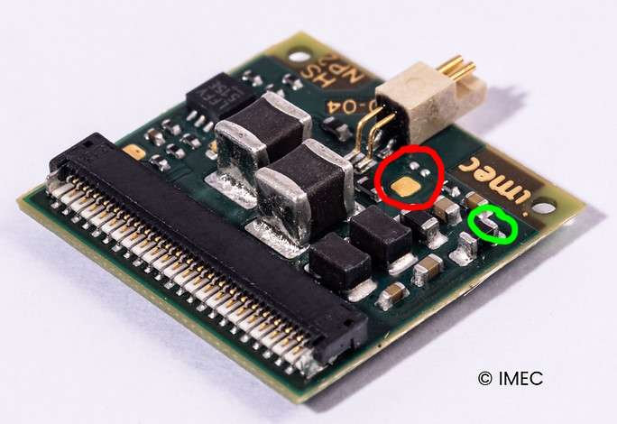

This is a project from the [**Cullen Lab at Johns Hopkins University**](https://www.bme.jhu.edu/people/faculty/kathleen-cullen/) for achieving sub-microsecond hardware synchronization of stimulation pulses with data from a [**Neuropixels™**](https://www.neuropixels.org/) 1.0 probe. Under good conditions (where stimulation pulses do not saturate/overload the Neuropixels recording amplifiers), this can allow for simple averaging and subtraction of stimulation artifacts, with negligible residuals, leaving clean neural signals which can be further processed with automatic spike detection, spike sorting, etc.

An Arduino [**Teensy 4.0 (PJRC.com)**](https://www.pjrc.com/store/teensy40.html) is used to implement the synchronization scheme.

* The 11.7MHz clock from the Neuropixels 1.0 headstage should be connected with a thin coaxial cable. The cable length should be kept as short as possible, preferably no more than about 40cm long or so, to preserve the signal integrity.
* The 74HTC00 chip is used to buffer the low-voltage headstage clock, which is only a few hundred mV peak-to-peak, and produce a clean 3.3V square wave required for the Teensy digital input. Note that the particular choice of the 74HCT00 is not critical. Any digital buffer chip that can accept the lower voltage clock and produce a clean 3.3V digital output should be acceptable.
* The Teensy's internal timer is clocked at 150MHz, allowing ~6.67nSec timing resolution.
* Trigger pulses from your experiment are fed into the Trigger input.
* Trigger outputs will be phase-locked to the Neuropixels 30KHz data samples (within the resolution of the Teensy 150MHz timers), such that there will be a delay of near 0uSec up to about 33uSec for each trigger, depending on the timing relationship between the trigger input and the Neuropixels sample clock. The trigger output signal should be connected to the  stimulation device trigger input, to generate the actual stimulation pulses.

Modifying the headstage to should be attempted only by persons experienced with surface mount soldering and rework techniques, since there is potential for damage or destruction of the headstage. The MIT license for this repository applies also to this modification. Proceed at your own risk. In no event shall the authors or copyright holders of this repository be liable for any claim, damages or other liability regarding this modification.

|11.7MHz clock signal is present on copper test pad (circled RED). A convenient ground connection is available on one end of a capacitor (circled GREEN)| The coax center conductor is soldered to the 11.7MHz test pad, and a ground wire is connected from the coax shield to the capacitor (the orange grounding wire is not related to this modification, and is not required).|
| :--- | :--- |
|||

* It is important to provide mechanical strain relief of the coaxial cable. The photo shows the white and yellow "tie downs" which are threaded through the mounting hole at the corner of the headstage board. Without this mechanical restraint, any mechanical stress on the cable may tear the pad off the headstage circuit board, causing permanent damage.
